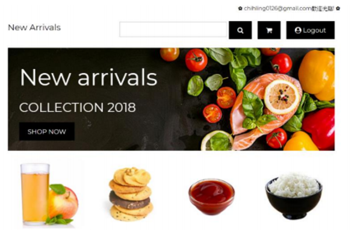
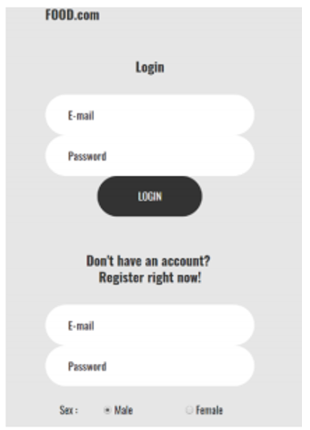
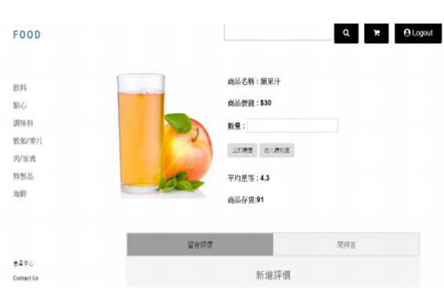
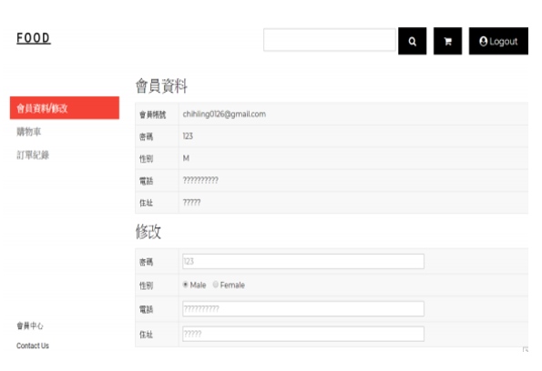

# DB_Project

## 食品購物網站

### 動機：
   <li> 隨著資訊時代來臨，線上食品交易也越來越蓬勃發展，因此，我們希望運用資料庫的概念，建立一個方便且實用的線上交易平台，讓整體的購物資訊能夠得到最佳的效用， 
  同時，也能幫助我們由日常生活的網路交易模式實際接觸資料庫的運作流程，更深入的了解這門課。 </li>
  <li>首頁＜/li>
   
     
   
  <li>註冊登入頁面＜/li>
   
     
   
  <li>商品頁面＜/li>
   
     
   
   <li>會員資料頁面＜/li>
   
     
